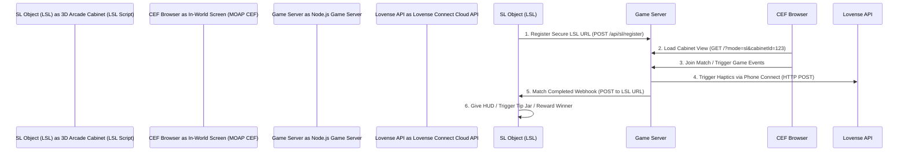

# Second Life Integration Plan: "Control & Chaos" Arcade Cabinet

This document outlines the architecture, implementation steps, and LSL (Linden Scripting Language) scripting templates required to port the **Control & Chaos** board game terminal into **Second Life (SL)** using **Media on a Prim (MOAP)**.

---

## 1. Architectural Overview

The integration relies on a three-way communication system:



1. **3D Arcade Cabinet (SL Object / LSL)**: Generates a temporary secure URL inside Second Life and registers it with the Node.js server.
2. **In-World Screen (CEF / MOAP)**: Renders the web frontend. It detects it is in "Second Life Mode" via URL query parameters (e.g. `?mode=sl&cabinetId=xyz`), simplifying the UI.
3. **Node.js Game Server**: Manages matches, tracks active cabinets, handles Lovense API haptic calls, and triggers LSL webhooks when matches conclude.

---

## 2. Step-by-Step Implementation Guide

### Step 1: LSL Registration Backend in `server.js`
We need endpoints on the Node.js server to track active Second Life cabinet instances and their secure callback URLs.

Add the following logic to `server.js`:

```javascript
// In-memory registry for active Second Life cabinets
const slCabinets = new Map();

// Register or refresh a Second Life Cabinet secure callback URL
app.post('/api/sl/register', (req, res) => {
    const { cabinetId, callbackUrl } = req.body;
    if (!cabinetId || !callbackUrl) {
        return res.status(400).json({ error: 'Missing cabinetId or callbackUrl' });
    }
    
    slCabinets.set(cabinetId, {
        callbackUrl,
        lastHeartbeat: Date.now()
    });
    
    console.log(`[SL Registry] Cabinet ${cabinetId} registered callback URL: ${callbackUrl}`);
    res.json({ success: true });
});

// Trigger a webhook back to the in-world cabinet when a match concludes
function notifySLMatchComplete(cabinetId, winnerName, winnerUuid) {
    const cabinet = slCabinets.get(cabinetId);
    if (!cabinet || !cabinet.callbackUrl) return;

    const payload = JSON.stringify({
        event: 'match_complete',
        winnerName,
        winnerUuid
    });

    const url = new URL(cabinet.callbackUrl);
    const options = {
        hostname: url.hostname,
        path: url.pathname + url.search,
        method: 'POST',
        headers: {
            'Content-Type': 'application/json',
            'Content-Length': Buffer.byteLength(payload)
        }
    };

    const http = url.protocol === 'https:' ? require('https') : require('http');
    const req = http.request(options, (res) => {
        console.log(`[SL Webhook] Event sent to SL. Response status: ${res.statusCode}`);
    });

    req.on('error', (e) => {
        console.error(`[SL Webhook] Failed to notify cabinet ${cabinetId}:`, e.message);
    });

    req.write(payload);
    req.end();
}
```

---

## 3. Frontend "Second Life Mode" Configuration

### Detecting SL Mode
In `public/index.html` (and each of the sub-game `index.html` files), add detection logic inside the window setup:

```javascript
const urlParams = new URLSearchParams(window.location.search);
const isSLMode = urlParams.get('mode') === 'sl';
const slCabinetId = urlParams.get('cabinetId');

if (isSLMode) {
    document.body.classList.add('sl-mode');
    
    // Auto-generate name based on player color/number instead of asking for input
    const localPlayerName = urlParams.get('playerName') || `Avatar_${Math.floor(Math.random() * 1000)}`;
    localStorage.setItem('sl_default_name', localPlayerName);
}
```

### CSS Layout Adjustments (`public/style.css`)
Hide headers, footers, notices, and banners when running inside Second Life:

```css
/* Hide unnecessary elements in Second Life mode */
body.sl-mode .site-notice-bar,
body.sl-mode .global-match-browser,
body.sl-mode .lobby-sponsor-banner,
body.sl-mode .lobby-sponsor-side,
body.sl-mode .site-footer {
    display: none !important;
}
```

---

## 4. LSL (Second Life) Script Template

Copy this LSL script directly into your 3D Arcade Cabinet prim in Second Life. It automatically requests an HTTP server URL, registers it with the Node.js server, and listens for the completion hook to trigger in-world actions (e.g. giving HUDs or chat output).

```lsl
// LSL Arcade Controller Config
string SERVER_URL = "http://play.controlandchaosgames.com"; // Replace with your Node server URL
string CABINET_ID = "Cabinet_Alpha_01";                   // Must match the cabinetId in your MOAP URL

key http_reg_request;
key url_request_id;
string secure_callback_url;

default
{
    state_entry()
    {
        // 1. Request a secure URL from Second Life to listen for incoming webhooks
        url_request_id = llRequestSecureURL();
    }

    http_request(key id, string method, string body)
    {
        if (id == url_request_id)
        {
            // The secure callback URL has been allocated by SL
            secure_callback_url = body;
            llOwnerSay("Callback URL Allocated: " + secure_callback_url);
            
            // 2. Register this callback URL with the Node.js server
            string registration_payload = "{\"cabinetId\":\"" + CABINET_ID + "\", \"callbackUrl\":\"" + secure_callback_url + "\"}";
            http_reg_request = llHTTPRequest(
                SERVER_URL + "/api/sl/register", 
                [HTTP_METHOD, "POST", HTTP_MIMETYPE, "application/json"], 
                registration_payload
            );
            
            // 3. Set up the browser display (MOAP) on side 1 of the prim
            // Directs CEF browser to include the mode=sl and cabinetId params
            string target_url = SERVER_URL + "/?mode=sl&cabinetId=" + CABINET_ID;
            llSetPrimMediaParams(1, [
                PRIM_MEDIA_CURRENT_URL, target_url,
                PRIM_MEDIA_HEIGHT_PIXELS, 1024,
                PRIM_MEDIA_WIDTH_PIXELS, 1024,
                PRIM_MEDIA_CONTROLS, PRIM_MEDIA_CONTROLS_NONE,
                PRIM_MEDIA_PERMS_INTERACT, PRIM_MEDIA_PERM_ANYONE
            ]);
        }
        else
        {
            // Handles incoming webhook requests from Node.js (when game concludes)
            if (method == "POST")
            {
                // Parse JSON payload (simple index searches for keys)
                integer eventIndex = llSubStringIndex(body, "\"event\"");
                integer winnerIndex = llSubStringIndex(body, "\"winnerName\"");
                
                if (eventIndex != -1 && winnerIndex != -1)
                {
                    // Locate winner's username
                    string winnerLabel = "\"winnerName\":\"";
                    integer start = llSubStringIndex(body, winnerLabel) + llStringLength(winnerLabel);
                    integer end = llSubStringIndex(llGetSubString(body, start, -1), "\"") + start - 1;
                    string winner_name = llGetSubString(body, start, end);
                    
                    llSay(PUBLIC_CHANNEL, "🏆 Match Complete! Congratulations " + winner_name + " on winning the match!");
                    
                    // Trigger in-world rewards:
                    // Find the avatar key in the region and give HUD/prizes
                    key winner_key = llRequestUserKey(winner_name);
                    
                    // Deliver in-world HUD item from object contents
                    llGiveInventory(winner_key, "Control & Chaos Arcade Winner HUD");
                }
                
                // Return 200 OK to the Node.js server
                llHTTPResponse(id, 200, "{\"status\":\"ok\"}");
            }
        }
    }

    http_response(key request_id, integer status, list metadata, string body)
    {
        if (request_id == http_reg_request)
        {
            if (status == 200)
            {
                llOwnerSay("Cabinet registration successful with Control & Chaos server!");
            }
            else
            {
                llOwnerSay("Error: Failed to register with server. Status: " + (string)status);
            }
        }
    }
}
```
